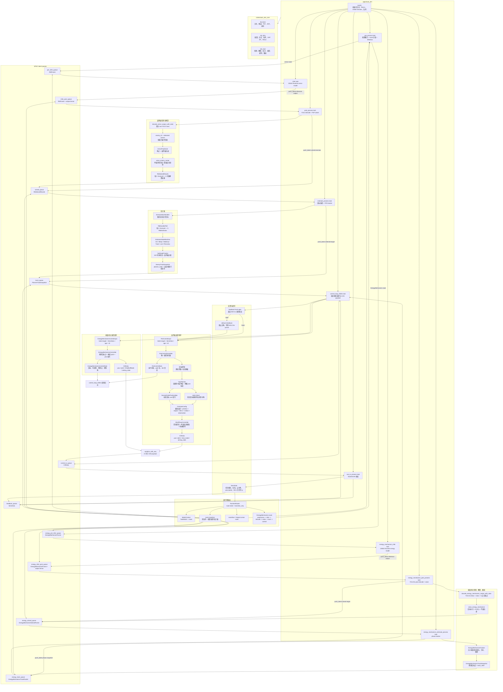

# 系统架构与发控主线

- 状态：维护中
- 日期：2026-06-16
- 范围：`auto_aim` 应用、`auto_aim_core`、估计器、发控闭环、通讯边界

## 摘要

这篇文档记录当前 Rust 自瞄主线的运行形态。它不是未来方案草稿，而是给后续维护用的系统地图。

当前主线是一个单进程、多 Tokio task 的异步流水线。视觉结果按帧推进，估计器输出目标快照，发控线程以固定 250 Hz 消费最新目标和反馈，最后序列化为 CAN 控制帧。`vivsionn` 的 `FireControl + ControlLoop250Hz` 行为已经收束到 Rust 的 `FireControlController`，主线线程只保留调度、反馈读取、CAN payload 构造和周期日志。

`TaskMode` 运行时路由也已经接进主线。`RuntimeRouter` 根据 `SensData` 中的任务模式维护当前 route 和 `transition_seq`，route 变化时清理旧队列并重置发控、估计器状态。`AutoShot` 和 `HitOutpost` 走装甲板流水线，`HitBigBuff` 和 `HitSmallBuff` 映射到内部 `EnergyMechanism` route，走能量机关检测、解算、跟踪和发控闭环。

## 总体架构

## 主线职责

`apps/auto_aim` 只负责把常驻 task 和队列接起来。每个 task 的职责保持窄：

1. `pre_process` 读取视频帧，根据 route 分发到装甲板或能量机关输入队列，并做各自模型输入尺寸和 letterbox，不做目标决策。
2. `infer` 和 `energy_mechanism_infer` 只运行各自 ONNX 模型，把输出 tensor 放进下一段队列。
3. `post_process` 完成装甲板检测筛选、PnP 和敌人中心解算，输出 `RbtSolvedResults`。
4. `energy_mechanism_post_process` 完成能量机关 YOLO11 pose decode、目标叶片/R 中心解算和位姿估计，输出 `EnergyMechanismSolvedFrame`。
5. `estimate_process` 选择唯一击打目标，维护装甲板 tracker，输出 `EnemyTrackSnapshot`。
6. `energy_mechanism_estimate_process` 维护能量机关相位、方向和预测状态，输出 `EnergyMechanismTrackSnapshot`。
7. `control_loop_250hz` 固定频率运行，只取当前 route 的最新目标和最新反馈，然后调用 `FireControlController` 或 `EnergyMechanismController`。
8. `can_io_process` 在 Linux 上用 SocketCAN 发送 `CtrlData`，接收反馈帧并合成 `SensData`。非 Linux 平台会显式返回不支持错误。

发控决策不写在 `control_loop_250hz` 里。主线线程可以记录日志，可以序列化 CAN payload，但不能重新散落一套 planner、MPC、开火判断。

运行时路由由 `RuntimeRouter` 统一维护。各 task 只读取当前 route：装甲板 route 继续处理帧，`EnergyMechanism` route 下普通装甲板流水线暂停，能量机关流水线接管 preprocess、infer、decode、solve、track 和 control。route 变化时由主线统一清理队列，避免旧模式的帧、解算结果和目标快照进入新模式。

## 估计器输出边界

估计器输出事实，不输出发控决策。

`EnemyTrackSnapshot` 的核心内容分三类：

1. 几何和运动状态：车体中心、速度、装甲板高度、车体 yaw、角速度、半径。
2. planner 输入：`planner_state()` 对齐 `YawPlanner` 的 11D 状态。
3. 发控门控信号：`motion_state`、`motion_uniform`、`observation_stable`、运动突变指标、`track_valid`、`fire_permit`。

其中 `observation_stable` 不只是 tracker 收敛状态。装甲板 jump 后，估计器会短时拉低这个信号，让发控继续瞄准但暂停自动开火，避免刚跳板时用不稳定观测触发发弹。

这样做的好处是估计器不用知道当前是 `AimOnly`、`ShotOnce` 还是 `AutoFire`。它只告诉发控目标是否有效、运动是否稳定、观测是否可信。

## 发控模块拆分

发控主线分三层。

第一层是目标控制。静态目标走 `static-direct`，稳定目标直接采用 planner 当前命中角，不走预瞄 MPC，避免稳定目标被模型滞后拖慢响应。动态目标走 `preview-mpc`，`YawPlanner` 生成 yaw 参考轨迹，`SecondOrderPositionMpc` 计算云台 yaw 指令，并保留 preview error 供开火窗口判断。

第二层是开火窗口多门控。`FireGateConfig` 根据目标距离计算 yaw 容差，检查预测 yaw 和参考 yaw 在开火 slot 附近的最大误差，根据目标旋转方向检查撞击角窗口，同时检查 MCU、motion、observation、follow、command stable 等门控位。

第三层是发弹相位。`ShotPhaseController` 不关心目标几何，只关心未来可射击 slot 数：首发 slot 可以在发弹周期内提前，但不能早于模型步长；只有一个可射击窗口时输出一次 `ShotOnce`；连续 slot 满足条件时进入 `AutoFire`；连发过程中短暂失去窗口时保留一小段 `AutoFire`，避免拨盘动作被过早撤回。

## 运行状态

`FireControlStats` 是长期维护发控状态的出口。当前周期日志会读取这些字段：

- 是否检测到目标。
- 当前控制模式：静态旁路或动态预瞄。
- yaw 容差、yaw 误差、首个 slot 误差、未来可射击 slot 数、下个 slot 延迟。
- gate 位：MCU、command stable、follow、preview、impact、slot、motion、observation。
- 最终 `ShotMode`。

如果后续要接入可视化 HUD 或 Rerun 控制曲线，优先从 `FireControlStats` 增加字段，不要在 app 线程里重新计算同一件事。

## 维护规则

1. 队列和 task 编排改动写在 `apps/auto_aim`。
2. 目标选择、tracker 状态和发控事实信号写在 `rbt_estimator`。
3. 普通自瞄发控决策写在 `rbt_fire_control::controller`。
4. 开火窗口数学判断写在 `rbt_fire_control::fire_gate`。
5. 发弹节奏写在 `rbt_fire_control::shot_phase`。
6. 能量机关检测、跟踪和发控写在 `rbt_energy_mechanism`。
7. 任务模式判断写在 `rbt_mode_context`，运行时 route 状态写在 `rbt_runtime_router`。
8. `control_loop_250hz` 不再新增局部 planner、局部 MPC 或局部 fire gate。

只要新增 task、队列、运行路线或发控门控，就同步更新这张图。
